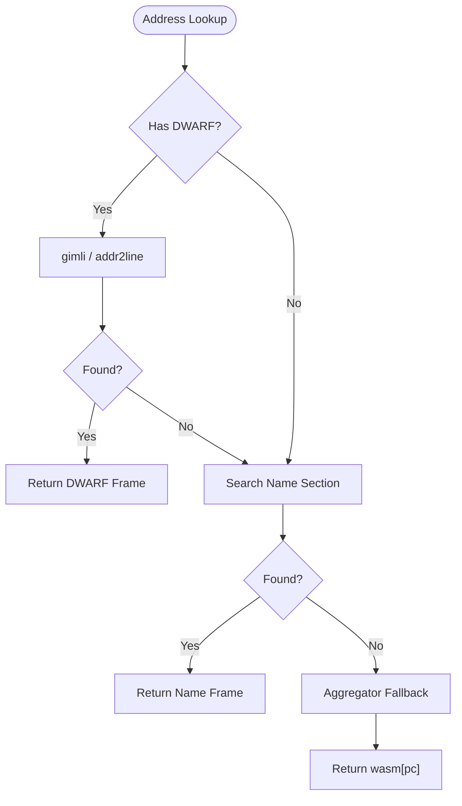

# DWARF Mapping: how a WASM address becomes a Rust source frame

Stage 2 of the pipeline (`src/source_map.rs`) turns the program counters in a `TraceEvent` stream
into the names a flamegraph shows. This is the contributor-facing guide to what `addr2line` actually
does with those bytes, and to the ways it can return nothing while every call in it succeeded.

Where the numbers come from: they are measured against the committed fixtures in this repository, on
`rustc 1.98.1` / `wasm32-unknown-unknown`. `docs/spikes/02_wasm_name_section_fallback.md` records the
build-side half of the story; this document covers the lookup-side half.

## DWARF in a wasm file is a pile of custom sections

An ELF or Mach-O binary has well-known program headers for debug info. A `.wasm` file has one section
type — "custom" (`id 0`) — and debug info arrives as several of them, each named exactly as the DWARF
section is named:

```
.debug_abbrev   .debug_info   .debug_line   .debug_ranges   .debug_str
```

They are *not* merged into one `DWARF` blob, so reading them needs no container parser: `object` and
`memmap2` are not dependencies, and `addr2line` is built with `default-features = false`. Optional
sections may simply be absent depending on the DWARF version — a DWARF 4 build has no
`.debug_line_str`, `.debug_addr` or `.debug_str_offsets` — which `gimli` is told about by handing it
empty bytes for that section id.

`WasmSections::parse` walks the section table (section id, payload length, then, for a custom
section, the name's length prefix and bytes) and keeps `name` plus anything starting with `.debug`.
That is the only hand-written parsing in the stage, and it lives on its own in
`src/source_map/wasm.rs` — the container walk needs nothing from `gimli`, and keeping it separate is
what makes the boundary above it checkable. Everything above it is `gimli`:

```rust
let dwarf = gimli::Dwarf::load(|id| reader(sections.get(id.name()).unwrap_or(&[])))?;
let context = addr2line::Context::from_dwarf(dwarf)?;
let frame = context.find_frames(address).skip_all_loads()?.next()?;
```

The `AGENTS.md` constraint "no custom DWARF parsing" is satisfied by that boundary: we slice *wasm*
sections, never DWARF ones. Note `Dwarf::load` copies each section into an `Rc<[u8]>` reader rather
than borrowing the caller's buffer, because the mapper has to outlive the `&[u8]` it was constructed
from and keep serving lookups for a whole trace.

## The address space, which is the part that bites

DWARF line tables in a wasm build are written against **offsets into the code section's payload**:
the bytes after the section id and its length, so address `0` is the function-count byte and each
function's body begins one byte-size-prefix after its own size LEB. They are not linear-memory
addresses, not file offsets, and not the `pc` any engine reports.

The base is measured, not assumed. In `fixtures/dwarf_probe/dwarf_probe.wasm` the code section's
payload starts at file offset `111`, and framing its three functions gives bodies at code-relative
`2..16`, `18..157` and `158..165` — which is exactly where `resolve` begins answering, so
`CodeMap::bodies` (wasm framing) and `SourceMapper::resolve` (DWARF) agree only if the base is right.
The same arithmetic holds on the 622 KB `dummy-contract` build, which additionally has four function
**imports**: its payload begins at file offset `190` and the first defined body is address `2`, while
that function's index in the module's index space is `4`. Code-section order, function index and file
offset are three different numbers, and conflating any two of them is the bug class here.

`CodeMap` is that translation, built during the same section walk that finds the DWARF:
`to_code_address(file_offset)` moves a position in the file into DWARF's space, `function_at(address)`
says which body contains it, and `SourceMapper::resolve_file_offset` does the two in order. It is
best effort by design — a module whose function list overruns its section yields
`SourceMapper::code_map() == None` rather than an error, because a caller already holding a DWARF
address needs no map.

What still cannot be resolved is an address from the engine, and that is a property of `wasmi` 2.0
rather than of this stage: its only execution hook, `Store::call_hook`, passes the hook *variant*
and nothing else — no callee, no instruction hook, no program counter — so every event the tracer
records is written at `pc = 0` (see `docs/internals/tracer_architecture.md` and
`ExecutionTracer::invoke_function`'s docs). It is not merely unexposed: the engine re-encodes wasm
bytecode into its own variable-length instruction stream during translation and retains no table back
to the original offsets, so even a leaked instruction pointer would be an index into a different
program. The finest code-section granularity reachable at runtime is therefore a **function body**,
which is what `CodeMap::bodies` is for. Three consequences to keep in mind when you touch this:

* A mapping bug here is invisible in CI and visible in output. `resolve(0)` on a real binary
  probably returns `None` — offset `0` is the function-count byte, before the first function's line
  program — so a broken translation shows up as an empty flamegraph, not a failing test.
* Never treat "resolved to nothing" as "is not an instruction". Addresses `0`, `1`, `16` and `17` of
  the fixture are inside the code section and belong to no function; `CodeMap::function_at` separates
  those two answers, which #162's degenerate-mapping warning depends on.
* `addr2line` probes the half-open range `[address, address + 1)`, so `u64::MAX` overflows inside the
  dependency and panics a debug build. `resolve` rejects that value before the lookup instead; no
  code section is within orders of magnitude of it.

## What one lookup can and cannot tell you

`Context::find_frames` returns an iterator of `Frame`s, each carrying both a `location` (file, line,
column) and a `function` (the symbol, plus its DWARF language). One call therefore answers file, line
and name — which is why `resolve` does not also call `find_location`.

Sweeping every byte offset of `fixtures/dwarf_probe/dwarf_probe.wasm`'s 165-byte code section answers
160 of its 166 addresses with 170 frames — ten of those addresses are inlined call sites — and 133 of
them with a line. The six misses (`0`, `1`, `16`, `17`, `157`, `165`) are gaps between function
ranges, and the hits are not uniform either. Each row below is that address's **innermost** frame;
`resolve` also hands back whatever inlined it (see *Inlined frames*).

| address | function name | file | line | why |
| --- | --- | --- | --- | --- |
| `0`, `1` | — | — | — | before the first function's range |
| `2` | `caller_of_heavy` | *none* | *none* | the prologue precedes the first line-program entry |
| `3`–`13` | `caller_of_heavy` | `…/src/lib.rs` | `39` | the call on the function's last line |
| `14` | `<u64>::wrapping_add` | `…/library/core/src/num/uint_macros.rs` | `2612` | inlined core code; the stack's second frame is `caller_of_heavy` at `39` |
| `15` | `caller_of_heavy` | `…/src/lib.rs` | `40` | back to the caller after that inlined copy |
| `16`, `17` | — | — | — | gap between function ranges |
| `61`–`71`, `75`–`89` | `memory_heavy_loop` | `…/src/lib.rs` | *none* | 26 addresses with a file and no line |
| `158` | `compute_heavy_loop` | `…/src/lib.rs` | `10` | attributes to the signature line |
| `165` | — | — | — | one past the last function's range |

`column` behaves the same way and is deliberately not in `SourceFrame` yet: the same sweep returns
`Some(39)` at `pc = 3`, `Some(13)` at `14`, and `Some(0)` at `158` — including a `0`, so a column is
another value that must stay an `Option` if it is ever surfaced.

So `SourceFrame`'s three fields have three different contracts, and this is deliberate:

* `function_name: String` is **required**. `CallStackNode`'s children are keyed by function name, so
  an unnamed frame would pool every unattributable address into one anonymous root and quietly absorb
  their cost. A frame DWARF gives no name for is dropped from the stack rather than built, and an
  address whose frames are all nameless answers with an empty `Vec`.
* `file_path` and `line_number` are **independent** `Option`s. A stripped build can still yield a
  name; a line table can still yield a file with no line. Never fold a missing line into `Some(0)` —
  line 0 is a real value in some DWARF, and `Option` is what distinguishes "absent" from "line zero".

## Which line a statement gets (#160)

A line table names the line that owns an instruction *after* optimization, which is not always the
line a reader expects. Two functions in the same fixture, built the same way, behave differently:

* `memory_heavy_loop` walks statement by statement — `20` is its signature (line `21`), `50` the
  buffer (`22`), `72` and `117` the fill loop (`24`, `25`), `90` and `96` the sum loop (`30`, `31`),
  `142` the closing brace (`35`).
* `compute_heavy_loop` shows none of that. Its `while i < 1000` counted loop folds to a closed form
  at `opt-level = "z"`, so `158`..=`163` all name line `10` — the `fn` signature — and `164` names
  `18`, the brace. Nothing resolves to lines `13`..=`15`.

Both are correct answers from the same build setting, and the difference is only what the optimizer
left behind. Phase 5's sampling inherits that: on an optimized contract a hot loop can show up as
its function's signature line, so "hottest line" is not "hottest statement" and the report should say
so rather than imply source-level precision the artifacts do not carry.

The check that holds this together is `tests/source_map_fixture.rs`: it reads the resolved line back
out of the committed source and compares **text**, so a base one byte off or a line program stepped
to the neighbouring row fails on the mismatch instead of passing with a plausible number. Its
`#[ignore]`d case runs the same assertions against `fixtures/build.sh`'s 622 KB Soroban build — the
only artifact with the real inlined-dependency stack (`compute_heavy_loop` inside `invoke_raw` inside
`invoke_raw_extern`, with `.cargo/registry` and `/rustc/<hash>` frames between them), which is why
that build is asserted by path suffix and never by count of distinct files.

## Inlined frames

`resolve` returns the **whole inline stack**, innermost frame first, because one frame per address
cannot say both what executed and who inlined it. For address `14` that is two frames:
`<u64>::wrapping_add` at `…/core/src/num/uint_macros.rs:2612`, then `caller_of_heavy` at
`…/src/lib.rs:39` — the second frame's line is the call site, which is the half a flamegraph reader
usually wants and the half a single-frame API threw away.

Measured over the fixture's 166 code-section addresses: 6 answer with nothing (the framing gaps), 150
with one frame, and 10 with two — `14`, and `101`..=`109`, the nine bytes of `memory_heavy_loop`
whose inlined `wrapping_add` all resolve to the same stack. `the_stack_depth_is_measured_across_the_whole_code_section`
pins that vector, so a fixture rebuild that changes the shape fails loudly instead of silently
changing what a profile looks like.

`ProfileAggregator` keys each frame on `stack[0]` and ignores the rest. That is deliberate, not
unfinished: the engine reports one boundary per wasm call
(`only_the_outer_invocation_is_recorded_as_a_boundary`), so pushing the inline stack as extra tree
levels would draw WASM frames for calls that never happened and move cost off the frame that paid
it. The stack's value today is the *call-site* line, which a reader can get from `stack[1]`; using it
to render inlined depth in the output is a Stage 4 formatting question, and nobody has measured what
it costs yet.

## Demangling

`FunctionName::demangle()` routes `DW_LANG_Rust` through `rustc-demangle` and formats with `{:#}`, the
alternate form that drops the crate-disambiguator hashes:

```
_RNvMs7_NtCsknUcikIyyBm_4core3numy12wrapping_add   (raw, from the fixture at address 14)
<u64>::wrapping_add                               (shown)
```

`rustc-demangle` is enabled in `Cargo.toml` specifically for this; `cpp_demangle` is not, and C++
symbols therefore pass through undemangled. When the language is absent or the name does not parse,
`demangle()` returns the raw symbol unchanged — which is why the mangled forms here come only from
inlined dependencies. All three fixture contract functions are `#[no_mangle] extern "C"`, so
`compute_heavy_loop` arrives as that plain C symbol, while the one `_R…` in the sweep is core's. That
makes a bare `_R` prefix reaching a frame a real bug rather than an expected shape, and there is a test
sweeping the whole fixture code section for exactly that.

### What demangling leaves: closure segments

Demangling does not make a name anonymous-free. rustc gives a closure no path segment of its own and
writes one of these instead, both measured from a probe crate whose `outer` function holds a closure
that holds a closure:

```
closure_probe::outer::{closure#0}       debug = 2, opt-level = 1 — each closure gets its own function
closure_probe::outer::{closure_env#0}   line-tables-only, opt-level = 3 — the body was inlined away
                                        and only the environment type survives, inside the generic
                                        arguments of whatever takes it
```

`collapse_closures` rewrites each one to `[closure]`, or `[closure#N]` where the segment carries an
index, and drops a segment whose entire separator since the previous one is `::`: a run of nested
closures is one frame in a flamegraph, not a stack of markers. The index survives on a closure that
is not part of a run, because two sibling closures in one function are different work and
`CallStackNode`'s children are keyed by name — flattening both to `[closure]` would pool them into a
single frame and lose which one spent the fuel.

`{{closure}}`, the spelling #155 names, is legacy mangling. v0 encodes a closure structurally
(`…13closure_probe5outer0E…` in the same crate's `name` section, the trailing digit being the
disambiguator), so `rustc-demangle` renders a modern closure as `{closure#N}` and neither probe build
contains a single `{{closure}}` byte. It is handled anyway: trimming one more brace level costs no
branch, and a pre-2020 artifact will hand exactly that form to #157's `name`-section path.

`{impl#0}` — an anonymous impl block — is the same species of noise and deliberately untouched. It is
not a closure, and the rewrite preserves every byte outside a closure segment, generic arguments
included.

## The `name` section is a different animal

`name` is a wasm custom section that maps function-index-space indices to symbol names. It is present
even when no DWARF is (`debug = false` builds carry it), it needs no `gimli`, and it gives function
names and nothing else — never a file, never a line. The full layout, its version-less framing quirk,
and the fact that binaryen deletes it unless `-g` is passed are in
`docs/spikes/02_wasm_name_section_fallback.md`.

## How #157 reads it

`NameSection::parse` walks the subsection chain — `u8 kind` + `uleb128 size` + body, no leading
version byte, which is only decidable because the bodies tile the payload exactly — and keeps kind `1`
alone. Kind `0` is the module name and kind `7`, which both fixtures carry, names globals; unknown
kinds are skipped rather than rejected, because the section is shared with proposals this stage never
reads. It lives in `src/source_map/names.rs`, which is the "needs no `gimli`" claim above as a file
boundary: nothing in that module names a DWARF type, so the fallback cannot have grown a dependency
on the traversal it is the alternative to.

Two things about the records decide the design, and both are #141's measurements rather than guesses:

* **`funcidx` counts the whole function index space, imports first**, while `CodeMap::bodies` is the
  *defined* function list. The import count therefore comes from the import section (id `2`), read in
  the same walk. Both committed fixtures have no import section at all, which is why their names start
  at `0` and why the offset needs its own synthetic test rather than a fixture one — a module whose
  import list does not parse yields **no** names instead of names aligned on a guess, because charging
  `memory_heavy_loop`'s cost to a host import's name is a wrong flamegraph where an unnamed one is only
  an unhelpful one.
* **The symbols are raw**, exactly as DWARF stores them (`_RNvMs7_NtCsknUcikIyyBm_4core3numy12wrapping_add`),
  so a name-section frame goes through the same demangling and closure collapsing as a DWARF frame.
  `addr2line`'s heuristics are used because the section carries no `DW_AT_language`; a name that will
  not parse is kept byte-for-byte, which is what makes `#[no_mangle] extern "C"` export names arrive
  plain from either source.

Precedence is DWARF, then `name`, then the `wasm[pc]` the aggregator falls back to. `resolve` consults
the names only when no DWARF is loaded — `name` names a whole function, so it can never be finer than
the line table beside it — and `resolve_from_name_section` stays public for a caller that wants the
coarser answer deliberately. #163 is the write-up of the order.



Loading changed with it: `SourceMapper::new` now accepts a binary whose only symbols are names, so
`MissingDebugInfo` means *neither* source is usable. The `wasm-opt`-without-`-g` artifact still loads
(and still resolves nothing, because its surviving DWARF describes pre-optimization code) — that case
is #162's, not this error's.

The check that holds the whole thing together is `dwarf_and_names_agree_on_the_function_that_owns_every_address`:
the two fixtures are the same three functions built twice, so the section's index table and gimli's
line tables are independent readers of one binary. Sweeping all 166 code-section addresses, the
outermost DWARF frame and the name-section entry name the same function at every one, including the
ten inlined call sites where DWARF answers with two frames and `name` answers with one.

## Repeating a lookup (#158)

`SourceMapper::resolve` remembers what it has already answered for this mapper, in a map bounded by
`RESOLUTION_CACHE_LIMIT` (4,096 addresses). What it saves is not free: `find_frames` has to locate
the line program covering the address, run it to that instruction, and rebuild each frame — the walk
dominates, not `gimli`'s indexing.

Measured by running one probe twice, against the #157 build and against this one, in the profile the
crate actually ships (`opt-level = "z"`, one machine, three runs each):

| case | uncached | cached | change |
| --- | --- | --- | --- |
| repeat one single-frame address (`pc 3`) | ~290–470 ns | ~105 ns | 3–4× faster |
| repeat an inlined call site (`pc 14`, `101` — two frames) | ~1.07 µs | ~160 ns | 7× faster |
| second sweep of the fixture's 166 addresses | ~360 ns each | ~110 ns each | 3× faster |
| sweep of the real 622 KB build's 488 addresses | ~570 ns each | ~180 ns each | 3× faster |
| **first** lookup of an address | ~480 ns each | ~660 ns each | **1.4× slower** |

The last row is the cost, and it is real: a miss now inserts, and a hit clones, so a run that never
repeats an address is slower than it used to be. Break-even is about one repeat, and a trace repeats
by construction — one event per call boundary, a loop is the same handful of addresses over and over,
and Phase 5's sampling turns each boundary into many.

Three decisions fall out of the measurements rather than from taste:

* **The `name`-section fallback is deliberately not cached.** It costs 59 ns to compute — a binary
  search over `CodeMap::bodies` plus one name clone — and answering from a map costs 103 ns, so
  caching the degraded path would make the degraded path slower. `resolve` returns through
  `resolve_from_name_section` before it touches the map, which is why that path is also the only one
  whose entry count stays at zero.
* **An address that resolves to nothing *is* stored.** That is the binary #141 measured at "0 of 270
  addresses resolve": a `wasm-opt`-without-`-g` artifact whose surviving line tables describe
  pre-optimization code, so every lookup walks a full program to answer "nothing", and it does so once
  per event. Caching the silence is the point of storing empties. (Today's engine reports `pc = 0` for
  every event, which costs ~18 ns uncached and ~28 ns cached — a wash, and the one case the cache
  cannot help.)
* **Overflow clears rather than evicting least-recently-used.** Clearing costs recomputation and never
  correctness, which is all a cache is allowed to cost; LRU bookkeeping or a new dependency would buy
  hit rate only for a workload that cycles through more distinct addresses than the cap, and such a
  trace has no locality for any policy to exploit.

The signature question #158 raised is settled the same way: `resolve` stays `&self` and the map lives
in a `RefCell`, because `ProfileAggregator::aggregate` takes `&SourceMapper`. Turning every caller's
borrow into a mutable one to save a line-program walk trades the wrong way, and the pipeline is
single-threaded, so a borrow flag is all the synchronization the map needs.

A cache you cannot observe is a cache you can delete, so the tests assert entry counts as well as
answers: `a_resolved_address_is_remembered_and_a_name_only_lookup_is_not` proves the map exists, stays
one-entry-per-address and skips the uncached path;
`the_cache_cannot_change_an_answer_across_a_whole_trace` sweeps all 166 addresses twice on one mapper
and once on a cold one and requires byte-for-byte agreement;
`a_trace_that_never_repeats_cannot_grow_the_cache_past_its_bound` feeds three times the limit and
checks both the bound and that the answers outlive the clear.

## Producing a binary this stage can map

```toml
[profile.release.package.your_contract]
debug = "line-tables-only"   # or `debug = 1` for inlined-function names too
```

and then profile `target/wasm32-unknown-unknown/release/<contract>.wasm`. If you run `wasm-opt`
yourself, pass `-g`; if you use `stellar contract build`, its optimize step passes no `-g` and the
deployed artifact cannot be mapped by either source. The trap to remember: an optimized binary still
*loads* — its `.debug_*` sections survive, `has_debug_info()` returns `true`, and every lookup returns
`None`, because the line table describes code the optimizer rewrote. `MissingDebugInfo` cannot fire
there, which is what #162's warning is for.

Costs, measured: `debug = "line-tables-only"` took the fixture contract from 3.1 KB to 622,507 bytes,
619 KB of which is the five `.debug_*` sections against a 488-byte code section. A `#![no_std]`,
`panic = "abort"` build shows the floor: the same three functions cost 1,690 bytes with DWARF
(`fixtures/dwarf_probe/dwarf_probe.wasm`) and 595 without (`dwarf_probe_no_debug.wasm`), which is why
the pair is committed and the big one is not.

## When a mapping resolves nothing

1. `has_debug_info()` — if `false`, decide which of the two shapes you have. A `name`-only mapper
   loaded successfully (#157): it answers every address inside a body with one frame, no file and no
   line. No mapper at all is the `MissingDebugInfo` path, whose message names the custom sections that
   *were* present, so you can see whether there was a `name` section that simply did not read.
2. Confirm the address space. `code_map()` gives the section's extent and each body's range:
   `to_code_address` returns `None` for an offset that is not in the code section at all, and
   `function_at` returns `None` for one that is in it but belongs to no function — a linear-memory or
   file offset will resolve nothing while looking perfectly plausible.
3. Sweep, don't sample. Iterate `0..code_size` calling `find_location` and count hits — that is how
   the 160/166 figure was produced, and how the "loads but resolves 0" case was distinguished from a
   missing-section case.
4. Look for an optimizer step between the build and the profile run.
5. Remember paths are the builder's: DWARF stores `DW_AT_comp_dir`, so a committed fixture carries the
   absolute path of the machine that built it, and tests should assert `ends_with` rather than equal.

## See also

* `src/source_map.rs` — the module docs carry the same facts at code level, plus the dependency
  rationale for `gimli`'s feature set.
* `src/source_map/wasm.rs` — the section walk itself, with the byte-assembly helpers its tests use
  to build modules that no toolchain here can emit.
* `src/source_map/names.rs` — the `name`-section fallback, and the synthetic-module helpers that pin
  the import offset neither committed fixture can.
* `docs/spikes/02_wasm_name_section_fallback.md` — what survives `wasm-opt` and `stellar contract
  build`, and the `name`-section layout.
* `docs/internals/tracer_architecture.md` — why the `pc` reaching this stage is currently always `0`.
* `fixtures/dwarf_probe/README.md` and `build.sh` — how the committed fixtures are made.
